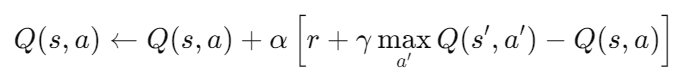
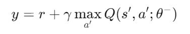
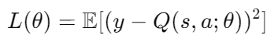
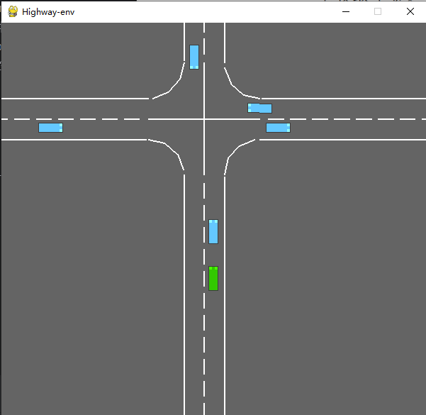
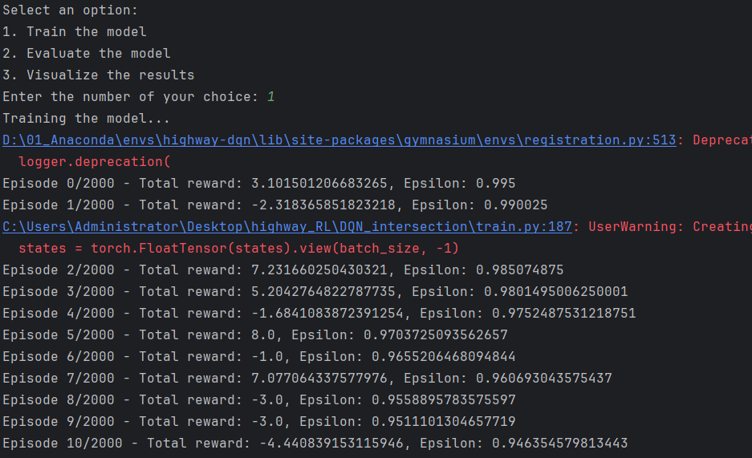
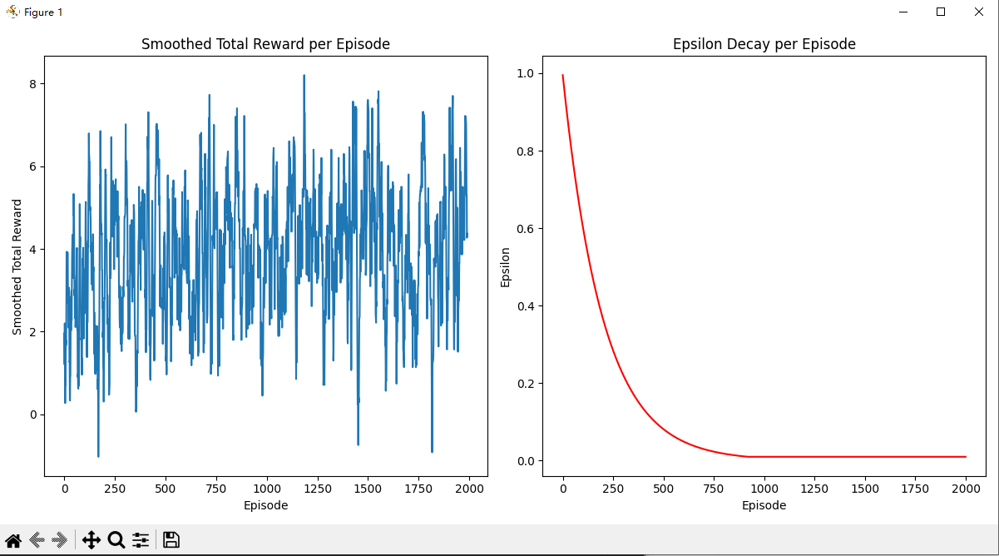

## 1 算法介绍
此项目采用经典的强化学习算法（ DQN（Deep Q-Network）算法）实现自动驾驶车辆在高速公路（highway）上的决策任务。
### 1.1 概述
DQN（深度 Q 网络）是一种用于强化学习的算法，将传统的 Q-learning 算法与深度神经网络相结合。

强化学习的目标是让智能体（agent）通过与环境的交互来学习最优的决策策略，以最大化累计奖励。
DQN 通过使用深度神经网络来逼近 Q 值函数，使得算法能够在复杂的高维状态空间中工作，例如视频游戏或自动驾驶中的感知问题。
### 1.2 相关原理
DQN 基于 Q-learning算法进行改进，是一种值函数方法，用于估计状态-动作对（state-action pair）的期望未来奖励。Q-learning 使用 Q 值函数
Q(s,a) 来表示在状态
s 下执行动作
a 能获得的预期累积奖励。
#### 1.2.1 Q-learning
Q-learning 是一种强化学习算法，属于值函数方法。它的目标是找到一种策略，使得智能体在每一个状态下选择的动作能够最大化其预期的累积奖励。

Q-learning 通过学习一个 Q 函数（Q-table 或 Q-value function），这个函数接受一个状态和一个动作作为输入，输出一个值（Q 值），表示在这个状态下执行这个动作能够获得的预期奖励。

Q-learning 的更新公式为：
<p align="center">
  
</p>
其中：

* s 是当前状态
* a 是当前动作
* r 是执行动作 a 后得到的奖励
* s' 是执行动作 a 后的下一状态
* α 是学习率，控制更新速度
* γ 是折扣因子，控制未来奖励的重要性

但是在普通的Q-learning中，当状态和动作空间是离散且维数不高时可使用Q-Table储存每个状态动作对的Q值，而当状态和动作空间是高维连续时，使用Q-Table不动作空间和状态太大十分困难。
因此，DQN在Q-learning的基础上进行改进。
#### 1.2.2 深度 Q 网络（DQN）
DQN 使用一个深度神经网络（Q 网络）来逼近 Q 值函数。神经网络的输入是状态 𝑠 ，输出是所有可能动作的 Q 值 
𝑄(𝑠,𝑎;𝜃)，其中 𝜃 是神经网络的参数。

为了稳定训练过程，DQN 引入了两个关键技术：

* 经验回放（Experience Replay）：智能体在与环境交互的过程中，会生成大量的经验数据（状态、动作、奖励、下一个状态）。这些数据被存储在一个固定大小的回放缓冲区中。在训练过程中，DQN 会随机抽取一个小批量的经验进行训练。这种做法打破了经验之间的时间相关性，提高了训练的稳定性。

* 目标网络（Target Network）：DQN 维护两个神经网络：当前 Q 网络（用于选择动作和更新 Q 值）和目标 Q 网络（用于计算目标 Q 值）。目标 Q 网络的参数每隔一定步数从当前 Q 网络复制而来，避免了网络参数频繁更新带来的不稳定性。

### 1.3 工作流程
1. **初始化：**
   * 初始化当前 Q 网络和目标 Q 网络，并随机初始化它们的参数。
   * 初始化经验回放缓冲区为空。
2. **与环境交互：**
   * 在每个时间步 𝑡 ，智能体根据当前 Q 网络的输出和 ε-greedy 策略选择动作。即，以 ε 的概率选择一个随机动作（探索），以 
   1 − 𝜖 的概率选择当前 Q 网络输出的最大 Q 值对应的动作（利用）。
   * 执行动作 𝑎 ，获得奖励 
   𝑟 和下一个状态 𝑠′。
   * 将经验(𝑠, 𝑎, 𝑟, 𝑠′)存储到回放缓冲区。
3. **经验回放：**
   * 从回放缓冲区中随机抽取一个小批量的经验(𝑠, 𝑎, 𝑟, 𝑠′)
   进行训练。
   * 对于每个经验，计算目标 Q 值 𝑦 ：
<p align="center">
  
</p>
    其中，
𝑄(𝑠′,𝑎′;𝜃−)是目标网络给出的 Q 值，𝜃−表示目标网络的参数

4. **更新 Q 网络：**
   * 使用梯度下降法最小化当前 Q 网络输出的 Q 值与目标 Q 值之间的均方误差（MSE）：
<p align="center">
  
</p>
    * 计算损失并更新当前 Q 网络的参数𝜃。

5. **更新目标网络：**
   * 每隔一定步数，将当前 Q 网络的参数 𝜃 复制到目标网络的参数 𝜃− 。

6. **重复：**
   * 重复步骤 2 到步骤 5，直到达到最大训练步数或其他终止条件。

## 2 本地部署

**文档说明：**
* main.py #主文件
* train.py #模型训练
* evaluate.py #模型评估
* visualize.py #可视化
* ReadMe.md #文档

### 2.1 虚拟环境配置
```
conda create -n env_name（环境名称可自行修改） python=3.8 # 安装虚拟环境
activate env_name
pip install highway-env==1.8.2
pip install gymnasium==0.29.1
```
### 2.2 具体步骤
#### 2.2.1 模型训练
```
def train_model():
    # DQN 网络模型定义
    class DQN(nn.Module):
        def __init__(self, input_size, output_size):
            super(DQN, self).__init__()
            self.fc1 = nn.Linear(input_size, 64)  # 第一层全连接层
            self.fc2 = nn.Linear(64, 64)          # 第二层全连接层
            self.fc3 = nn.Linear(64, output_size) # 输出层

        def forward(self, x):
            x = torch.relu(self.fc1(x))  # 激活函数 ReLU
            x = torch.relu(self.fc2(x))  # 激活函数 ReLU
            x = self.fc3(x)              # 输出层
            return x

    # 设置环境和超参数
    env = gym.make("intersection-v0", render_mode='human')  # 创建环境
    state_size = env.observation_space.shape[0] * env.observation_space.shape[1]  # 输入特征大小
    action_size = env.action_space.n  # 动作空间的大小
    batch_size = 32                   # 批次大小
    gamma = 0.99                      # 折扣因子
    epsilon = 1.0                     # 贪婪策略的初始值
    epsilon_min = 0.01                # 贪婪策略的最小值
    epsilon_decay = 0.995             # 贪婪策略的衰减因子
    learning_rate = 0.001             # 学习率
    target_model_update_freq = 10     # 目标模型更新频率
    memory = deque(maxlen=2000)       # 经验回放队列

    model = DQN(state_size, action_size)  # 创建模型
    target_model = DQN(state_size, action_size)  # 创建目标模型
    target_model.load_state_dict(model.state_dict())  # 初始化目标模型
    optimizer = optim.Adam(model.parameters(), lr=learning_rate)  # 优化器

    # 选择动作的策略
    def choose_action(state):
        if np.random.rand() <= epsilon:  # 贪婪策略
            return random.randrange(action_size)  # 随机选择
        state = torch.FloatTensor(state).unsqueeze(0)  # 转换为 tensor
        state = state.view(state.size(0), -1)  # 调整维度
        q_values = model(state)  # 获取 Q 值
        return torch.argmax(q_values).item()  # 返回 Q 值最大对应的动作

    # 经验回放和训练过程
    def experience_replay():
        if len(memory) < batch_size:  # 如果记忆不足以进行一次训练，则跳过
            return
        batch = random.sample(memory, batch_size)  # 从记忆中随机抽取一批
        states, actions, rewards, next_states, dones = zip(*batch)
        states = torch.FloatTensor(states).view(batch_size, -1)  # 状态
        actions = torch.LongTensor(actions).unsqueeze(1)  # 动作
        rewards = torch.FloatTensor(rewards)  # 奖励
        next_states = torch.FloatTensor(next_states).view(batch_size, -1)  # 下一个状态
        dones = torch.BoolTensor(dones)  # 结束标志

        current_q_values = model(states).gather(1, actions).squeeze(1)  # 当前 Q 值
        with torch.no_grad():
            next_q_values = target_model(next_states).max(1)[0]  # 下一状态的 Q 值
        target_q_values = rewards + (gamma * next_q_values * ~dones)  # 目标 Q 值

        loss = nn.MSELoss()(current_q_values, target_q_values)  # 计算损失
        optimizer.zero_grad()  # 清零梯度
        loss.backward()  # 反向传播
        optimizer.step()  # 更新模型参数

    # 训练过程
    episode_rewards = []  # 记录每个回合的奖励
    episode_epsilon = []  # 记录每个回合的 epsilon 值
    model_dir = os.path.join(os.path.dirname(os.path.abspath(__file__)), "model")
    os.makedirs(model_dir, exist_ok=True)  # 创建模型保存文件夹

    episodes = 500  # 训练回合数
    for episode in range(episodes):
        state = env.reset()  # 初始化环境
        total_reward = 0
        done = False
        while not done:
            action = choose_action(state)  # 选择动作
            next_state, reward, done, _, info = env.step(action)  # 执行动作

            memory.append((state, action, reward, next_state, done))  # 保存经验
            experience_replay()  # 进行经验回放和训练

            state = next_state  # 更新状态
            total_reward += reward  # 累加奖励

        if epsilon > epsilon_min:  # 更新 epsilon 值
            epsilon *= epsilon_decay

        if episode % target_model_update_freq == 0:  # 更新目标模型
            target_model.load_state_dict(model.state_dict())

        episode_rewards.append(total_reward)
        episode_epsilon.append(epsilon)

        print(f"Episode {episode}/{episodes} - Total reward: {total_reward}, Epsilon: {epsilon}")

    # 保存模型和日志
    torch.save(model.state_dict(), os.path.join(model_dir, 'dqn_model.pth'))
    with open(os.path.join(model_dir, 'training_log.txt'), 'w') as log_file:
        for reward, eps in zip(episode_rewards, episode_epsilon):
            log_file.write(f"Reward: {reward}, Epsilon: {eps}\n")

    print("Model and logs saved successfully!")
```
通过深度 Q 网络（DQN）在一个模拟的交通环境中进行强化学习，训练模型来选择最优动作。。
* 定义模型（DQN）：创建一个简单的深度Q网络（DQN）。模型有三层全连接层（fc1, fc2, fc3），使用 ReLU 激活函数。
* 设置环境和超参数：创建一个 intersection-v0 环境。超参数如学习率、折扣因子、epsilon（用于ε-贪婪策略）等已定义。
* 选择动作（choose_action）：如果 epsilon 值大于随机值，则随机选择一个动作（探索）；否则，选择最大 Q 值的动作（利用）。
* 经验回放（experience_replay）：从经验回放队列中随机抽取一批数据，并进行 Q 值的更新。通过 MSE 损失计算预测值与目标 Q 值之间的误差，并反向传播更新网络。
* 训练循环：每个回合从环境重置开始，选择动作并更新状态、奖励。随着训练的进行，模型会更新目标模型的参数。epsilon 值会逐步衰减，减少探索的频率，增加模型的利用。
* 保存模型和日志：训练结束后，保存训练好的模型和训练日志至model文件夹。


#### 2.2.2 模型评估
```
def evaluate_model():
    class DQN(nn.Module):
        def __init__(self, input_size, output_size):
            super(DQN, self).__init__()
            self.fc1 = nn.Linear(input_size, 64)
            self.fc2 = nn.Linear(64, 64)
            self.fc3 = nn.Linear(64, output_size)

        def forward(self, x):
            x = torch.relu(self.fc1(x))
            x = torch.relu(self.fc2(x))
            x = self.fc3(x)
            return x

    env = gym.make("intersection-v0", render_mode='human')
    state_size = env.observation_space.shape[0] * env.observation_space.shape[1]
    action_size = env.action_space.n

    model_dir = os.path.join(os.path.dirname(os.path.abspath(__file__)), "model")
    model = DQN(state_size, action_size)
    model.load_state_dict(torch.load(os.path.join(model_dir, 'dqn_model.pth')))
    model.eval()

    def choose_action(state):
        if isinstance(state, tuple):
            state = state[0]
        state = torch.FloatTensor(state).unsqueeze(0)
        state = state.view(state.size(0), -1)
        q_values = model(state)
        return torch.argmax(q_values).item()

    def evaluate():
        total_reward = 0
        state = env.reset()
        done = False
        while not done:
            action = choose_action(state)
            next_state, reward, done, _, info = env.step(action)
            state = next_state
            total_reward += reward

        print(f"Total reward in evaluation: {total_reward}")

    evaluate()
```
evaluate.py 的核心任务是加载已训练好的模型，并在环境中进行评估，以测试模型在实际应用中的表现。（注意：我们使用训练过程中最优的动作选择策略
（即 Q 值最大化）来进行评估，不涉及 epsilon-贪婪策略的随机性。）
* 定义模型（DQN）：DQN 类和 train.py 中定义的模型相同。我们使用三层全连接层（fc1, fc2, fc3）来构建神经网络，最终输出 Q 值。
这个模型结构与训练阶段相同，确保评估时使用的是与训练阶段相同的架构。
* 创建环境：使用 gym.make() 创建一个 intersection-v0 环境，state_size 和 action_size 用于确定模型的输入和输出维度，分别表示状态空间和动作空间的大小。
* 加载训练好的模型：通过 torch.load() 加载训练过程中保存的模型权重，并将其加载到模型中。
* 选择动作：与训练时相同，在评估阶段，我们使用 epsilon-贪婪策略来选择动作。这里我们只执行贪婪策略，即选择当前 Q 值最大的动作。
* 评估过程：evaluate() 函数中，初始化环境并让智能体在环境中执行动作。每一步中，智能体选择一个动作并更新状态，累积奖励直到回合结束。最终输出评估过程中的总奖励。

#### 2.2.3 模型预测与可视化
```
# 简单的移动平均函数
def moving_average(data, window_size):
    return [sum(data[i:i+window_size]) / window_size for i in range(len(data) - window_size + 1)]

def visualize_results():
    model_dir = os.path.join(os.path.dirname(os.path.abspath(__file__)), "..", "model")

    episode_rewards = []  # 用于存储每个回合的总奖励
    episode_epsilon = []  # 用于存储每个回合的epsilon值

    # 从训练日志文件中读取奖励和epsilon值
    with open(os.path.join(model_dir, 'training_log.txt'), 'r') as log_file:
        for line in log_file:
            reward, epsilon = line.strip().split(", ")  # 分割每一行的奖励和epsilon
            episode_rewards.append(float(reward.split(": ")[1]))  # 存储奖励值
            episode_epsilon.append(float(epsilon.split(": ")[1]))  # 存储epsilon值

    # 对奖励进行平滑处理
    smoothed_rewards = moving_average(episode_rewards, window_size=10)  # 使用窗口大小为10的移动平均

    # 创建一个图形窗口
    plt.figure(figsize=(12, 6))

    # 绘制第一个子图：每个回合的奖励（平滑后的）
    plt.subplot(1, 2, 1)
    plt.plot(smoothed_rewards, label='Smoothed Reward')
    plt.title('Smoothed Total Reward per Episode')
    plt.xlabel('Episode')
    plt.ylabel('Smoothed Total Reward')

    # 绘制第二个子图：epsilon的衰减
    plt.subplot(1, 2, 2)
    plt.plot(episode_epsilon, label='Epsilon', color='r')
    plt.title('Epsilon Decay per Episode')
    plt.xlabel('Episode')
    plt.ylabel('Epsilon')

    # 调整图像的布局，使得图形不会重叠
    plt.tight_layout()

    # 显示图形
    plt.show()
```
visualize.py 文件的作用是直观地看到训练过程中模型的学习进展，包括奖励的变化和 epsilon 的衰减。
* 定义 moving_average(data, window_size) 函数：使用移动平均对奖励进行平滑处理，可以帮助我们更清晰地看到奖励随时间的变化趋势，去除单个回合的随机波动。
window_size 是控制平滑程度的参数，窗口大小越大，平滑效果越明显，但可能会使曲线失去一些细节。如果想要更细腻的奖励波动，可以尝试使用较小的窗口大小，例如 5 或 3。
* 定义 visualize_results 函数：该函数的主要任务是从保存的日志文件中读取训练过程中每个回合的奖励值和 epsilon 值，并绘制它们的图表。 
* 奖励（Reward）：每个回合中智能体获得的总奖励。 
* Epsilon：在 epsilon-贪婪策略中，epsilon 控制随机选择动作的概率。随着训练的进行，epsilon 通常会逐渐衰减。
* 读取训练日志文件：model_dir为获取保存训练模型和日志文件的目录路径。
使用 open() 函数打开 training_log.txt 文件，该文件中记录了每个回合的奖励和 epsilon 值。
* 绘制图表：使用 plt.figure(figsize=(12, 6)) 创建一个图形窗口，并设置窗口的大小。
使用 plt.plot() 绘制每个回合的奖励曲线和 epsilon 的衰减曲线，并添加相应的标题、标签和颜色。
使用 plt.show() 显示最终绘制的图形。


## 3 完整Demo
```
import sys
from utils.train import train_model
from utils.evaluate import evaluate_model
from utils.visualize import visualize_results

def main():
    print("Select an option:")
    print("1. Train the model")
    print("2. Evaluate the model")
    print("3. Visualize the results")

    choice = input("Enter the number of your choice: ")

    if choice == '1':
        print("Training the model...")
        train_model()
    elif choice == '2':
        print("Evaluating the model...")
        evaluate_model()
    elif choice == '3':
        print("Visualizing the results...")
        visualize_results()
    else:
        print("Invalid choice. Exiting.")
        sys.exit(1)

if __name__ == "__main__":
    main()
```

仿真环境如下图：
<p align="center">
  
</p>

模型训练过程如下：
<p align="center">
  
</p>

在intersection-v0环境下进行2000次训练的奖励曲线和 epsilon 的衰减曲线如下所示：
<p align="center">
  
</p>
